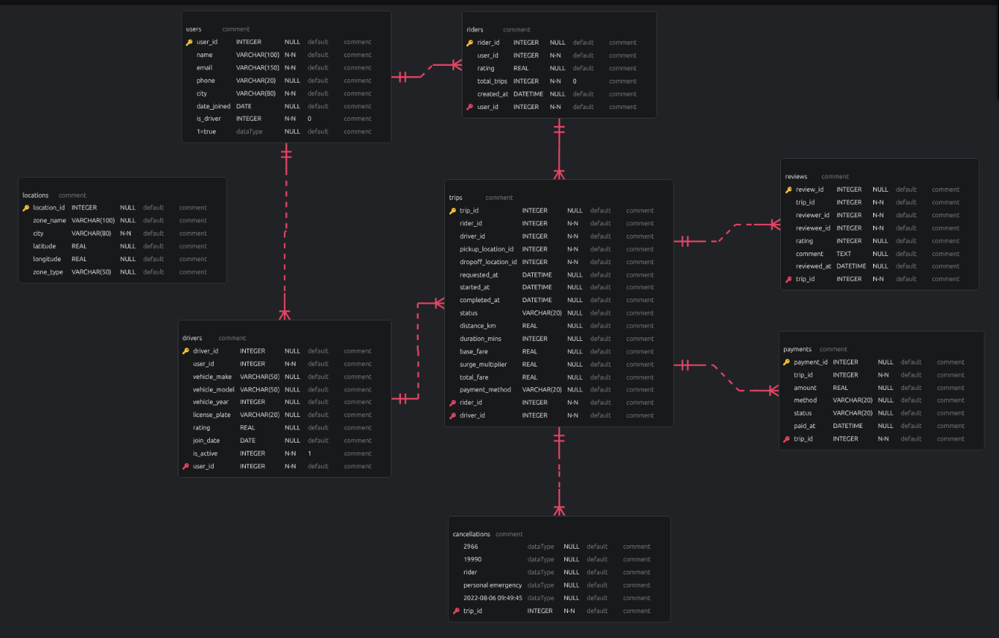

# Uber Multi-City Revenue Analysis: A Spatial & Supply-Demand EDA

## 📌 Project Overview
This project investigates a specific revenue anomaly within a multi-city Uber dataset of 2,000 users: **Why do the top 30 highest-earning drivers exclusively reside in Houston and Los Angeles?**

By analyzing market saturation (rider-to-driver ratios) and spatial factors (trip distances and geographic city size), this analysis uncovers the operational mechanics that allow drivers in specific regions to significantly out-earn their peers.

## 📊 Database Architecture (ERD)

---

## 🔍 The Investigation: Breaking Down the "Why"

### 1. Market Saturation (Supply vs. Demand)
An analysis of active drivers versus rider populations revealed distinct market conditions across the four cities:
*   **New York (Hyper-Saturation):** Has the highest number of drivers (98) but the lowest number of riders (371). High competition drives down individual earner potential.
*   **Chicago (Moderate Saturation):** Balanced but competitive market with 81 drivers and 380 riders.
*   **Houston (Healthy Demand):** High rider volume (442) balancing out a robust driver pool (94).
*   **Los Angeles (The Supply Gap):** The least saturated market. It holds the second-highest rider demand (407) but the lowest number of active drivers (78), giving individual drivers a massive competitive advantage.

### 2. The Spatial Factor (Trip Distance vs. Trip Volume)
Initially, trip volume seemed like the answer, but the data disproved this: **New York had the highest total number of trips, yet lagged in revenue.** 

Looking at **Total Distance Covered** solved the puzzle:
*   **Geographic Advantage:** Houston and Los Angeles are massive, sprawling metropolitan areas. 
*   **Distance = Revenue:** Total distance covered was directly proportional to total revenue. Houston topped both metrics, followed by Los Angeles. Chicago ranked last in both total distance and revenue.
*   **The Proportionality:** Long-distance trips in sprawling cities yield higher fares per ride compared to short, congested trips in hyper-saturated environments like New York.

---

## 💡 Final Synthesis
The top 30 drivers are concentrated in Houston and Los Angeles due to a dual advantage:
1.  **Houston Drivers** leverage massive scale; the city has the highest rider demand and the largest geographic footprint, leading to long, high-fare trips that offset moderate driver competition.
2.  **Los Angeles Drivers** leverage market inefficiency; they enjoy long-distance geographic trips while facing the lowest driver competition (78 drivers to 407 riders) across the entire dataset.

---

## 🛠️ Tech Stack & Skills Shown
- **SQL Metrics:** Aggregations, multi-table `JOIN` operations, filtering, and data profiling.
- **Economic Principles Applied:** Supply & Demand Elasticity, Market Saturation, Spatial/Urban Economics.

---

## 5. Data Provenance
*   **Data Source:** Sourced from [Kaggle](https://www.kaggle.com/datasets/rockyt07/uber-sql-database?select=schema.sql)
